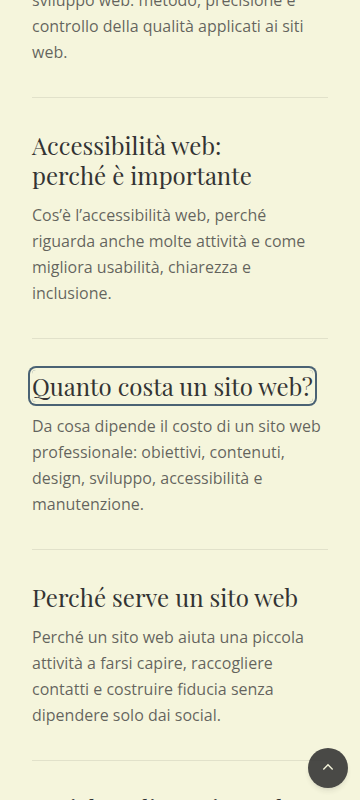
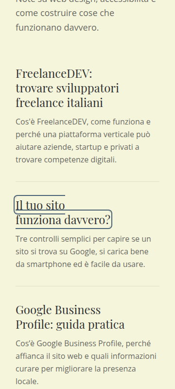
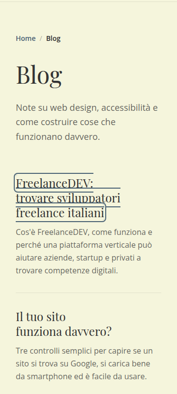
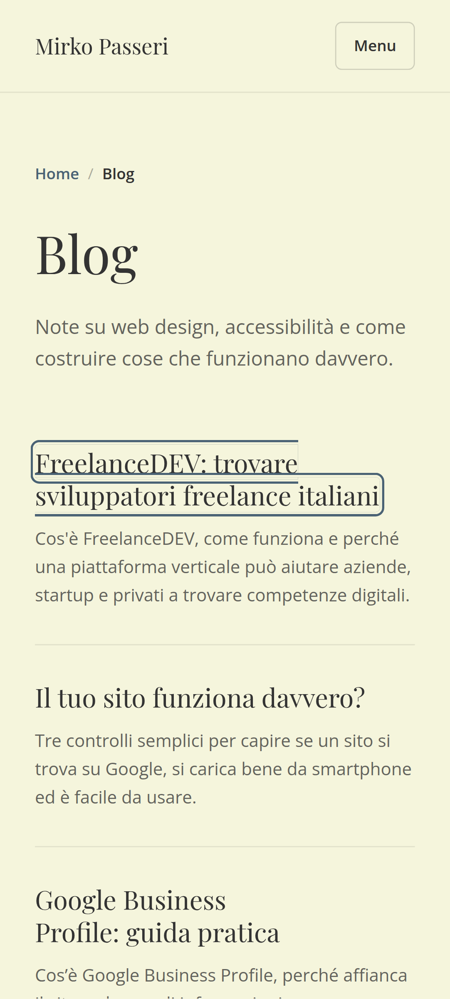
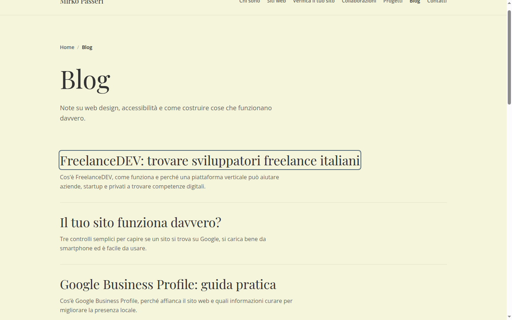

# Verifica focus titoli Blog

## Esito sintetico

**Problema legato al rendering dei link multilinea, confermato.**

Il focus è raggiunto realmente con il tasto `Tab`, è visibile e non viene tagliato. Il difetto compare quando il titolo va a capo: il link che riceve il focus è un elemento `inline` e Chrome lo divide in un rettangolo per ogni riga. Le utility Tailwind `focus:ring-*` producono un `box-shadow` attorno a ciascun frammento, non un unico rettangolo attorno al titolo completo.

Su mobile i ring delle righe adiacenti si sovrappongono e attraversano visivamente l'area occupata dai glifi. Il caso più evidente è il titolo su tre righe a 360 px. Il Pixel 7a, a 412 × 915 CSS px, riproduce lo stesso difetto su due righe. A 1440 px tutti i titoli misurati restano su una riga e il ring appare regolare.

La causa non è un `outline-offset` negativo, un'ombra interna, un'altezza fissa, un `overflow: hidden`, un `line-clamp`, una trasformazione o un doppio elemento focusabile.

## Scenario di riproduzione

- Pagina: `/blog/`, generata con la build di produzione corrente e servita localmente.
- Browser: Google Chrome 148.0.7778.215, modalità headless con Chrome DevTools Protocol.
- Font caricati prima delle misure: `document.fonts.ready` completato; font effettivo dei titoli `"Playfair Display Variable"`.
- Navigazione: eventi tastiera `Tab` inviati a Chrome tramite `Input.dispatchKeyEvent`; non è stato forzato `:focus` o `:focus-visible` via CSS.
- Risultato del focus da tastiera: per tutti i 12 link degli articoli, `:focus = true` e `:focus-visible = true`.
- Primo titolo raggiunto: quinto `Tab` nelle viewport mobile, undicesimo `Tab` a 1440 px perché la navigazione desktop espone più link prima del contenuto.
- Viewport testate: 360 × 800, 390 × 844, 393 × 873, 412 × 915 con DPR 2,625, 430 × 932 e 1440 × 900.
- Viewport meta rilevato: `width=device-width, initial-scale=1.0`.
- Overflow orizzontale rilevato nelle viewport mobile: 0 px.

Passaggi per riprodurre manualmente:

1. Aprire `/blog/`.
2. Non cliccare nel contenuto e premere `Tab` fino al primo titolo di articolo.
3. A 360 px osservare `FreelanceDEV: trovare sviluppatori freelance italiani`, che occupa tre righe.
4. Continuare con `Tab` fino a `Il tuo sito funziona davvero?`, su due righe.
5. Confrontare con `Quanto costa un sito web?`, su una riga, oppure con la resa a 1440 px.

Screenshot principali:

### Titolo su una riga — 360 × 800



### Titolo su due righe — 360 × 800



### Titolo su tre righe e difetto più evidente — 360 × 800



### Pixel 7a — 412 × 915 CSS px



### Confronto desktop — 1440 × 900



Sono disponibili anche le acquisizioni a [390 × 844](blog-focus-screenshots/390x844--2-righe--freelancedev-trovare-sviluppatori-freelance-italiani.png), [393 × 873](blog-focus-screenshots/393x873--2-righe--freelancedev-trovare-sviluppatori-freelance-italiani.png) e [430 × 932](blog-focus-screenshots/430x932--2-righe--freelancedev-trovare-sviluppatori-freelance-italiani.png).

## Evidenze geometriche

| Titolo | Viewport | Righe | Display | Bounding box | Client rects | Outline | Offset | Problema |
| ------ | -------: | ----: | ------- | ------------ | -----------: | ------- | -----: | -------- |
| Quanto costa un sito web? | 360 × 800 | 1 | `inline` | 280,81 × 32 px | 1: 280,81 × 32 | `none` | 1 px, non dipinge | Nessuna frammentazione; ring regolare |
| Il tuo sito funziona davvero? | 360 × 800 | 2 | `inline` | 194,91 × 62 px | 2: 101,64 × 32; 194,91 × 32 | `none` | 1 px, non dipinge | Ring separato per riga; sovrapposizione verticale |
| FreelanceDEV: trovare sviluppatori freelance italiani | 360 × 800 | 3 | `inline` | 213,06 × 92 px | 3: 157,73 × 32; 213,06 × 32; 180,08 × 32 | `none` | 1 px, non dipinge | Difetto più evidente, tre ring frammentati |
| FreelanceDEV: trovare sviluppatori freelance italiani | 390 × 844 | 2 | `inline` | 315,56 × 62 px | 2: 240,97 × 32; 315,56 × 32 | `none` | 1 px, non dipinge | Ring frammentato e sovrapposto |
| FreelanceDEV: trovare sviluppatori freelance italiani | 393 × 873 | 2 | `inline` | 315,56 × 62 px | 2: 240,97 × 32; 315,56 × 32 | `none` | 1 px, non dipinge | Come a 390 px |
| FreelanceDEV: trovare sviluppatori freelance italiani | 412 × 915, Pixel 7a | 2 | `inline` | 315,56 × 62 px | 2: 240,97 × 32; 315,56 × 32 | `none` | 1 px, non dipinge | Problema confermato con DPR 2,625 |
| FreelanceDEV: trovare sviluppatori freelance italiani | 430 × 932 | 2 | `inline` | 315,56 × 62 px | 2: 240,97 × 32; 315,56 × 32 | `none` | 1 px, non dipinge | Problema confermato |
| FreelanceDEV: trovare sviluppatori freelance italiani | 1440 × 900 | 1 | `inline` | 843,73 × 48 px | 1: 843,73 × 48 | `none` | 1 px, non dipinge | Ring unico e regolare |

Valori computed comuni durante il focus da tastiera:

- `position: static`;
- mobile: `font-size: 24px`, `line-height: 30px`, `font-weight: 400`;
- desktop da `md`: `font-size: 36px`, `line-height: 45px`;
- `padding: 0px`, `margin: 0px`;
- `border: 0px solid`, `border-radius: 4px`;
- `overflow: visible` sul link, sull'`h2` e sul contenitore `li`;
- `transform: none`;
- `-webkit-line-clamp: none`, `-webkit-box-orient: horizontal`;
- `box-shadow: ... rgb(245, 245, 220) 0 0 0 2px, rgb(74, 98, 116) 0 0 0 4px ...`;
- pseudo-elementi `::before` e `::after`: `content: none`, nessun box geometrico, nessuna ombra e nessun outline dipinto.

Il dato determinante è la geometria verticale. A 360 px ogni rettangolo di testo/link è alto 32 px, ma le righe iniziano a intervalli di 30 px, coerenti con il `line-height`. I frammenti inline si sovrappongono già geometricamente di 2 px. Il ring Tailwind si estende fino a 4 px all'esterno di ogni frammento: tra due righe adiacenti le estensioni del ring occupano quindi una fascia comune di circa 10 px. Questa fascia attraversa l'area della riga successiva.

Il `getBoundingClientRect()` del link multilinea restituisce l'unione complessiva dei frammenti, ma `getClientRects()` restituisce due o tre rettangoli distinti. Il rendering del `box-shadow` segue questi ultimi, non il rettangolo di unione né il box della card.

## Struttura HTML e CSS coinvolta

### Componente e file

Non è coinvolto alcun componente React. Le card del Blog sono generate direttamente dalla pagina Astro [src/pages/blog/index.astro](../src/pages/blog/index.astro), righe 62–78. Il componente generico `Card.astro` non è usato in questa lista.

Struttura effettiva semplificata:

```html
<ul class="space-y-8">
  <li class="group border-b border-primary/10 pb-8">
    <article>
      <h2 class="font-title text-2xl md:text-4xl text-primary mb-3 leading-tight break-words text-balance group-hover:text-accent transition-colors duration-300">
        <a
          href="/blog/.../"
          class="focus:outline-none focus:ring-2 focus:ring-accent focus:ring-offset-2 focus:ring-offset-master focus:rounded"
        >
          Titolo articolo
        </a>
      </h2>
      <p class="text-primary/75 leading-relaxed max-w-2xl">Descrizione</p>
    </article>
  </li>
</ul>
```

Il solo elemento focusabile della card è l'`a` dentro l'`h2`. Non ci sono link annidati, link estesi sulla card, elementi assoluti o un secondo focus applicato al contenitore.

### Selettori e stati

- Elemento: `main ul li article h2 > a`.
- Focus generato dalle utility: `.focus\:outline-none:focus`, `.focus\:ring-2:focus`, `.focus\:ring-accent:focus`, `.focus\:ring-offset-2:focus`, `.focus\:ring-offset-master:focus`, `.focus\:rounded:focus`.
- Non esiste un selettore `:focus-visible` specifico per questo link. Con `Tab`, il browser fa comunque corrispondere sia `:focus` sia `:focus-visible`; lo stile visuale arriva però dalle varianti `focus:`.
- Hover: lo stato `group-hover:text-accent` cambia soltanto il colore dell'`h2`, con transizione di 300 ms; non crea un secondo ring.
- Stato attivo: nessuna regola specifica rilevata.

Il reset Tailwind imposta sugli anchor un normale `display: inline`. La utility `focus:outline-none` rimuove l'indicatore nativo e le utility `ring` lo sostituiscono con due ombre esterne: 2 px del colore di sfondo come offset e ulteriori 2 px accent, per un'estensione totale di 4 px.

### Regole responsive attive

- Sotto 768 px: `text-2xl`, cioè 24 px; `leading-tight`, cioè 30 px.
- Da 768 px: `md:text-4xl`, cioè 36 px; `leading-tight`, cioè 45 px.
- Il contenuto usa `px-8` su mobile, quindi larghezza utile pari alla viewport meno 64 px; da `md` usa `px-24` e `max-w-7xl`.
- `text-balance` modifica la distribuzione delle parole tra le righe, ma non crea il difetto. Il difetto si manifesta ogni volta che il link rimane inline e viene frammentato.
- Il font title è dichiarato in [src/styles/global.css](../src/styles/global.css), righe 22–27, ed è importato localmente in [src/layouts/BaseLayout.astro](../src/layouts/BaseLayout.astro), righe 2–4.

## Causa principale

La causa è la combinazione tra **link inline multilinea** e **focus ring Tailwind realizzato con `box-shadow`**.

Un elemento inline non genera necessariamente un solo box rettangolare: quando va a capo, genera un frammento per ogni riga. Chrome restituisce questi frammenti attraverso `getClientRects()` e dipinge il `box-shadow` con `border-radius: 4px` su ogni frammento. Il risultato è una serie di capsule/contorni distinti, con bordi orizzontali intermedi.

Il `line-height` mobile è 30 px mentre i rettangoli misurati sono alti 32 px. Le ombre esterne aggiungono 4 px sopra e sotto ciascun frammento. I bordi inferiori della riga precedente e quelli superiori della successiva si sovrappongono quindi nell'area del testo. Il ring non segue il box completo del titolo, non segue la card e non usa un pseudo-elemento.

Il problema cambia con il wrapping, non con una media query specifica del focus. Può quindi apparire anche su desktop o a zoom elevato se un titolo torna su più righe.

## Cause secondarie

1. **Spazio verticale ridotto tra frammenti.** Il `line-height` di 30 px è inferiore all'altezza dei rettangoli inline misurati, 32 px. Aumentarlo potrebbe attenuare l'incrocio, ma non eliminerebbe la frammentazione del ring.
2. **`border-radius` applicato a ogni frammento.** I 4 px di raggio rendono più visibili le capsule interne e le giunzioni tra righe.
3. **Uso di `focus:` anziché `focus-visible:`.** Il test ha rilevato il ring anche dopo click mouse e tap emulato (`:focus = true`, `:focus-visible = false`) perché le classi reagiscono a ogni focus. Questo non causa la sovrapposizione, ma può renderla visibile anche dopo input non da tastiera.
4. **`text-balance`.** Cambia il punto di a capo e quindi la forma dei frammenti. Non è la causa e non dovrebbe essere rimosso solo per questo problema.
5. **Rendering del font.** Le metriche di Playfair Display spiegano in parte la differenza tra line-height e rettangolo inline, ma il comportamento strutturale rimane con qualsiasi font quando il link viene frammentato.

Cause escluse dalle misure:

- outline dipinto o offset negativo: l'outline è `none`; l'offset computed di 1 px non ha effetto;
- ombra interna: il ring è esterno;
- clipping: tutti i contenitori hanno `overflow: visible`;
- altezza fissa, clamp, `-webkit-box`, trasformazioni, margini negativi o posizionamento assoluto: assenti;
- pseudo-elementi: `content: none`;
- doppio focus o link annidati: assenti;
- sovrapposizione con descrizione o card successiva: non rilevata; il difetto resta interno al titolo.

### Differenze per modalità di input

| Input | `:focus` | `:focus-visible` | Ring | Nota |
| --- | ---: | ---: | --- | --- |
| Tastiera, `Tab` reale | sì | sì | sì | Caso accessibilità principale e riprodotto su tutte le viewport |
| Mouse, solo hover | no | no | no | Cambia soltanto lo stato hover del gruppo |
| Mouse, click | sì | no | sì | Le classi sono `focus:`, non `focus-visible:` |
| Touch emulato Pixel 7a | sì | no | sì | Il tap emulato mantiene il ring finché il link resta focalizzato |

L'emulazione mobile riproduce viewport, DPR, touch e user agent, ma non sostituisce una prova su un dispositivo Android reale. Il modo in cui Chrome conserva il focus dopo una navigazione o dopo il tasto Indietro può variare; la geometria dei frammenti CSS resta però indipendente dal DPR e risulta già confermata nel browser.

## Impatto sull'accessibilità

- **Focus visibile:** presente. Il colore accent `#4A6274` ha contrasto circa 5,77:1 rispetto allo sfondo `#F5F5DC`, superiore al rapporto 3:1 normalmente richiesto per distinguere un indicatore grafico.
- **Leggibilità:** ridotta sui titoli multilinea perché i bordi intermedi attraversano l'area dei glifi. Il contrasto tra ring e testo `#333333` è circa 1,98:1; la sovrapposizione non cancella il testo, ma ne disturba chiaramente la lettura.
- **Clipping e oscuramento da altri contenuti:** non rilevati. Il focus non è nascosto da header, card adiacenti o overflow del genitore.
- **Corrispondenza area evidenziata/cliccabile:** tecnicamente coerente con i frammenti cliccabili del link inline, ma la forma frammentata comunica male l'area come un unico controllo.
- **Outline nativo:** viene rimosso, ma esiste un'alternativa visibile. Il problema è la qualità geometrica dell'alternativa, non l'assenza completa di focus.
- **WCAG 2.2:** il criterio 2.4.7 Focus Visible risulta soddisfatto; non è emersa una chiara violazione del 2.4.11 Focus Not Obscured, perché il controllo non è nascosto da altro contenuto. Rimane un difetto reale di leggibilità e chiarezza dell'indicatore, di severità **media**, da correggere per una navigazione da tastiera pulita.

## Correzioni consigliate

Nessuna correzione è stata applicata.

| Strategia | File/proprietà | Vantaggi | Rischi | Comportamento atteso |
| --- | --- | --- | --- | --- |
| **Rendere il link `inline-block` — consigliata** | `src/pages/blog/index.astro`; aggiungere `display: inline-block`/utility equivalente al link | Crea un solo principal box rettangolare e mantiene una larghezza vicina al titolo; elimina i ring per-frammento con modifica minima | Può cambiare leggermente baseline, altezza della line box e distribuzione con `text-balance`; va verificato alle stesse viewport | Un unico ring rettangolare anche su due o tre righe; desktop sostanzialmente invariato |
| Rendere il link `block` | Stesso link; `display: block` | Soluzione molto robusta; un solo box largo quanto l'`h2`; area di focus stabile | Evidenzia e rende cliccabile anche lo spazio vuoto fino al bordo destro; ring visivamente più largo del testo | Un unico rettangolo a larghezza piena su mobile e desktop |
| Spostare il ring sul contenitore con `:focus-within` | `h2` o `li`; ring sul genitore quando il link è focalizzato | Elimina completamente la frammentazione senza cambiare il link | Se applicato alla card evidenzia un'area che non è interamente cliccabile; richiede coordinare la rimozione del ring sul link | Ring unico sull'heading o sulla card; maggiore differenza visiva rispetto all'attuale |
| Aumentare `outline-offset` | Sostituire il ring con un outline e regolare l'offset | Indicatore semplice e indipendente dalle ombre Tailwind | Un outline su un elemento ancora inline può seguire comunque una sagoma frammentata; l'offset da solo non risolve la causa | Efficace solo insieme a `inline-block` o `block` |
| Mantenere un `box-shadow` esterno | Ring attuale dopo aver cambiato il display | Conserva colori e sistema visivo esistente | Da solo non è una correzione: l'ombra attuale è già esterna | Con un solo principal box diventa un ring unico e pulito |
| Aggiungere padding interno | Link reso prima `inline-block`/`block` | Aumenta la distanza visiva tra glifi e ring | Cambia wrapping, altezza e spaziatura; su un inline frammentato può peggiorare le giunzioni | Utile soltanto come rifinitura successiva, non necessario per la causa principale |
| Ring su pseudo-elemento/card | Contenitore `position: relative`, pseudo-elemento attivato da `:focus-within` | Massimo controllo sulla geometria del focus | Maggiore complessità; rischio di indicare come cliccabile tutta la card quando lo è solo il titolo | Ring rettangolare sull'intera area scelta, indipendente dal testo |
| Usare varianti `focus-visible:` | Classi del link | Evita che click e tap mostrino lo stesso ring quando il browser non considera il focus visibile | Non risolve il ring frammentato da tastiera; va mantenuta un'alternativa per `:focus-visible` | Migliore coerenza tra tastiera e puntatore, da combinare con il cambio di display |

La soluzione più proporzionata è rendere il link `inline-block` e mantenere il ring esistente, quindi verificare che `text-balance` e le spaziature non cambino in modo indesiderato. Se si preferisce una fascia interattiva coerente per tutta la riga del titolo, `block` è ancora più prevedibile, ma amplia visivamente e funzionalmente l'area cliccabile.

Non è consigliato tentare di risolvere aumentando solo il `line-height` o l'offset: ridurrebbe l'effetto ma lascerebbe più indicatori distinti per lo stesso link.

## Conclusione

Il difetto è reale e riproducibile in Chrome con navigazione da tastiera. Compare nelle viewport mobile testate quando il titolo occupa più righe: a 360 px raggiunge tre righe ed è più evidente; tra 390 e 430 px, incluso il Pixel 7a a 412 × 915, compare su due righe. A 1440 px non compare perché i titoli restano su una riga.

Il problema dipende dal titolo multilinea, non dal dispositivo Pixel 7a in sé. Il link inline genera più line box e il ring basato su `box-shadow`, con offset totale di 4 px e raggio di 4 px, viene dipinto separatamente attorno a ciascun frammento. L'intervento più robusto e meno invasivo è creare un unico principal box focusabile con `inline-block`; `block` è l'alternativa se si vuole intenzionalmente una zona titolo a larghezza piena.
